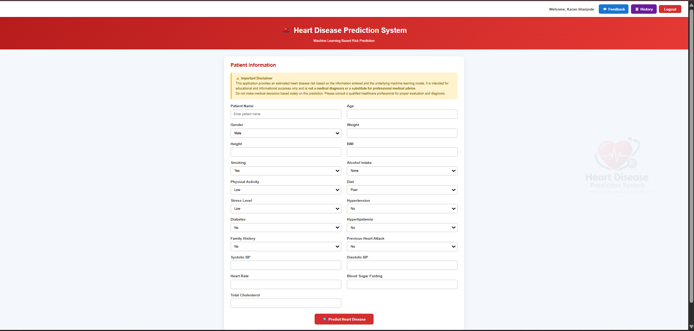

# ❤️ Heart Disease Prediction System

A machine-learning-based web application that provides a preliminary prediction of heart disease risk from patient health information.

The system combines **Python, Scikit-learn, Django, PostgreSQL and cloud deployment** to provide an end-to-end machine learning application.

## 🚀 Live Demo

🌐 **Live Application:**  
https://heart-disease-prediction-system-yqnm.onrender.com

## 📌 Project Overview

The Heart Disease Prediction System allows an authenticated user to enter patient health information and receive a machine-learning-based prediction along with the predicted probability.

The application also stores prediction records in a PostgreSQL database so users can view their previous predictions.

> ⚠️ **Medical Disclaimer:** This application is intended for educational and demonstration purposes only. It provides a preliminary machine-learning prediction and should not be considered a medical diagnosis or a replacement for professional medical advice.

## 🎯 Objectives

- Build a machine-learning model for binary heart disease prediction.
- Process and prepare health-related data for machine learning.
- Integrate the trained model into a Django web application.
- Provide a simple interface for entering patient information.
- Display prediction results and probability.
- Provide user authentication.
- Store and manage prediction history.
- Deploy the application online with persistent PostgreSQL storage.

## 🛠️ Technologies Used

| Technology | Purpose |
|---|---|
| Python | Application and ML development |
| Pandas | Data processing |
| NumPy | Numerical operations |
| Scikit-learn | Machine learning |
| Django | Web application framework |
| PostgreSQL | Database |
| Neon | Cloud PostgreSQL database |
| HTML / CSS | User interface |
| Git & GitHub | Version control |
| Render | Cloud deployment |

## 🤖 Machine Learning

The project uses **Logistic Regression** for binary classification.

### ML Workflow

```text
Dataset
   ↓
Data Cleaning
   ↓
Exploratory Data Analysis
   ↓
Feature Preparation
   ↓
Feature Scaling
   ↓
Model Training
   ↓
Model Evaluation
   ↓
Saved ML Model
   ↓
Django Integration

## 📊 Dataset

The dataset contains **50,000 records** with health-related attributes including:

- Age
- Gender
- Weight
- Height
- BMI
- Smoking
- Alcohol Intake
- Physical Activity
- Diet
- Stress Level
- Hypertension
- Diabetes
- Hyperlipidemia
- Family History
- Previous Heart Attack
- Systolic Blood Pressure
- Diastolic Blood Pressure
- Heart Rate
- Fasting Blood Sugar
- Total Cholesterol
- Heart Disease

## 🌐 Application Features

### 🔐 User Authentication

- User registration
- User login
- User logout

### 🧑‍⚕️ Patient Prediction

- Patient information form
- Health parameter input
- Machine-learning prediction
- Prediction probability
- Risk result display

### 📋 Prediction History

- View previous predictions
- View prediction details
- Delete prediction records
- User-specific prediction history

### 💬 Feedback

- Submit feedback through the application

### 🗄️ Persistent Database

User accounts, prediction records and feedback are stored using PostgreSQL.

## 🏗️ System Architecture

```text
                    User
                     │
                     ▼
              Django Web App
                     │
                     ▼
            Patient Information
                     │
                     ▼
          Data Preparation / Scaling
                     │
                     ▼
          Machine Learning Model
          (Logistic Regression)
                     │
                     ▼
          Prediction + Probability
                     │
                     ▼
             PostgreSQL Database
                     │
                     ▼
             Prediction History

## 📸 Application Screenshots

### Patient Prediction Form

